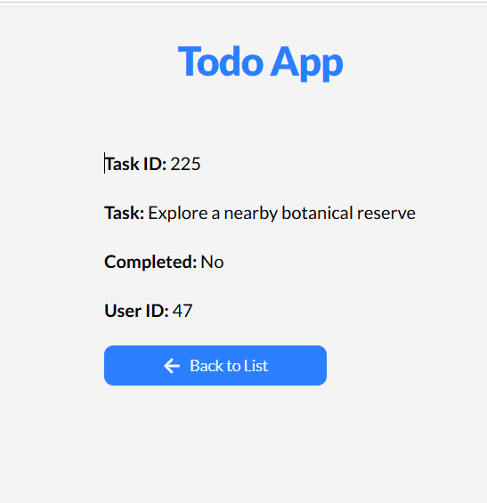

# Todo App

This todo app built with Vue provides a simple and intuitive way of tracking your tasks.

## Features 

* Create new tasks
* Update existing tasks
* Delete tasks
* Mark tasks as completed
* Filter tasks by all, active and completed
* Search tasks


* Paginated tasks (10 tasks per page)


* View individual tasks to get more details 

## Technology Stack

The following tools were used in this project:

* Vue
* ShadCN/UI for Vue
* DummyJSON API
* Tailwind CSS
* Tanstack (Vue) Query
* Axios
* Localforage
* Vue Icons

## Installation and Setup

To get started with this project, ensure you have Node.js installed (v20 or higher).

1. Clone this repository:

```bash
git clone https://github.com/Techylawyer/todo-app-vuejs.git

cd todo-app-vuejs
```
2. Install the necessary packages and dependencies

```bash
npm install
```

3. Start the development server

```bash
npm run dev
```

## API Integration
 
 * The DummyJSON Todo API (https://dummyjson.com/todos) for generating a default list of todos
 * Tanstack (Vue) Query  for data fetching
 * Localforage for data caching and persistence

 ## Styling

* ShadCN/UI for component styling and color consistency
* Tailwind CSS for CSS utility classes

 ## Available Scripts
 * ```npm run dev``` - start the development server
 * ``` npm run build``` - build for production
 * ```npm run preview``` preview production build

 ## Future Improvements

 * Light and dark theme toggle
 * Search all todos functionality
 * Implement offline capability